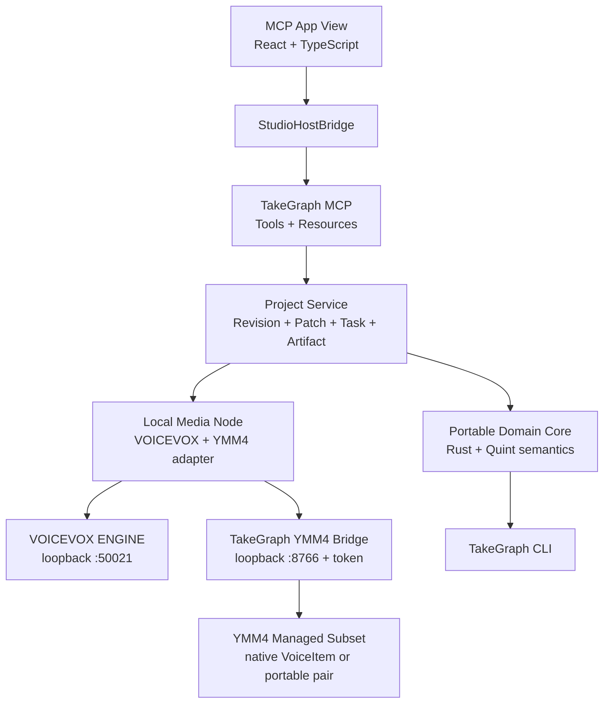
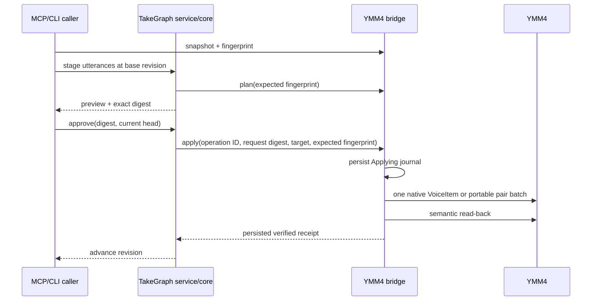

# Architecture

TakeGraph separates its portable control plane from host and media concerns.

## Authority boundaries

The Rust core owns deterministic meaning: revision guards, approval freshness, VoiceTake state, artifact freshness, timeline impact, and later subtitle segmentation. It does not perform I/O.

The project service is the canonical authority. YMM4 is a projection target,
not the TakeGraph project database. An external export advances the TakeGraph
revision only after the bridge returns a verified read-back receipt.

The MCP App view owns ephemeral UI state and gestures. `StudioHostBridge` keeps React components independent of a specific MCP host and permits standalone development.

The media node owns provider and platform I/O. Both adapters accept loopback
endpoints only. VOICEVOX AudioQuery JSON and WAV bytes are stored immutably by
SHA-256. The YMM4 client speaks a private versioned HTTP protocol authenticated
by a random local token.

## YMM4 export transaction

The portable compatibility realization appends a managed marker to caption
text using invisible Unicode tag characters. Protocol v2 native voice
realizations carry their stable TakeGraph identity in `VoiceItem.Remark` and
are verified semantically instead of by requiring two physical items.
Unrelated YMM4 items are counted for concurrency fingerprints but never
rewritten.

## First invariants

- A patch commits only from `Approved`.
- Approval is bound to the exact patch digest.
- The patch base must equal the current project head.
- Hard-locked values cannot be committed.
- Mutation after approval invalidates that approval.
- An accepted voice take must have a materialized audio artifact.
- An asynchronous voice completion must still match revision, speech hash, and query hash.
- A YMM4 export is rejected if its preview fingerprint is stale.
- An external operation ID is applied at most once and has a durable receipt.
- TakeGraph revision advances only after verified YMM4 read-back.

These are represented in Rust tests and, for ordering/state exploration,
`specs/protocols/patch_protocol.qnt` and
`specs/protocols/ymm4_apply_protocol.qnt`.

The planned boundary between portable TakeGraph semantics and YMM4-native
voice, character, timeline, effect, template, save, and render operations is
specified in [YMM4 Native Integration Boundary](ymm4-native-integration.md).
That plan also separates semantic apply verification from a future visual scene
inspection workflow: YMM-rendered frame captures are imported and reviewed as
content-addressed artifacts, while final video correctness still requires an
authoritative render receipt.
