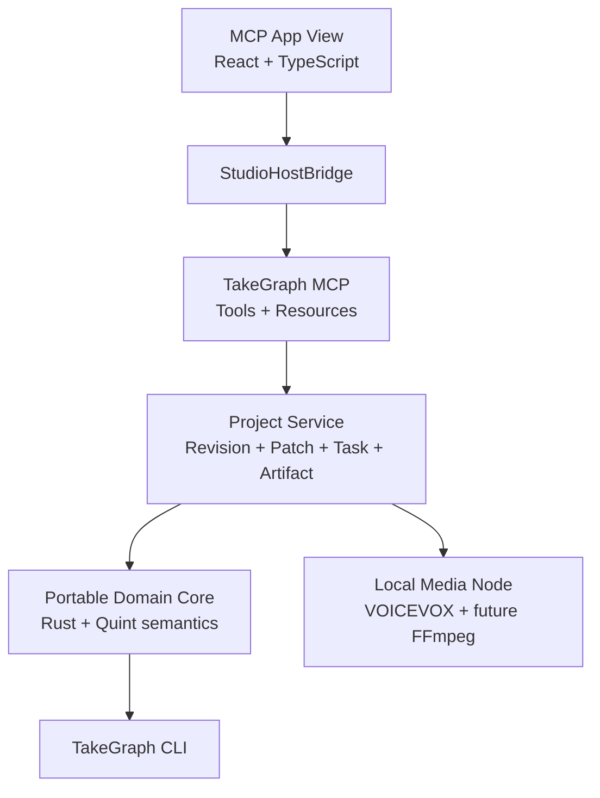

# Architecture

TakeGraph separates its portable control plane from host and media concerns.

## Authority boundaries

The Rust core owns deterministic meaning: revision guards, approval freshness, VoiceTake state, artifact freshness, timeline impact, and later subtitle segmentation. It does not perform I/O.

The project service is the canonical authority. The current in-memory façade exists to prove that commit operations pass through the core. SQLite persistence is the next storage step.

The MCP App view owns ephemeral UI state and gestures. `StudioHostBridge` keeps React components independent of a specific MCP host and permits standalone development.

The media node owns provider and platform I/O. The initial provider accepts loopback endpoints only and connects to an existing VOICEVOX ENGINE. Generated WAV and AudioQuery persistence will live behind this boundary.

## First invariants

- A patch commits only from `Approved`.
- Approval is bound to the exact patch digest.
- The patch base must equal the current project head.
- Hard-locked values cannot be committed.
- Mutation after approval invalidates that approval.
- An accepted voice take must have a materialized audio artifact.
- An asynchronous voice completion must still match revision, speech hash, and query hash.

These are represented in Rust tests and, for ordering/state exploration, `specs/protocols/patch_protocol.qnt`.

